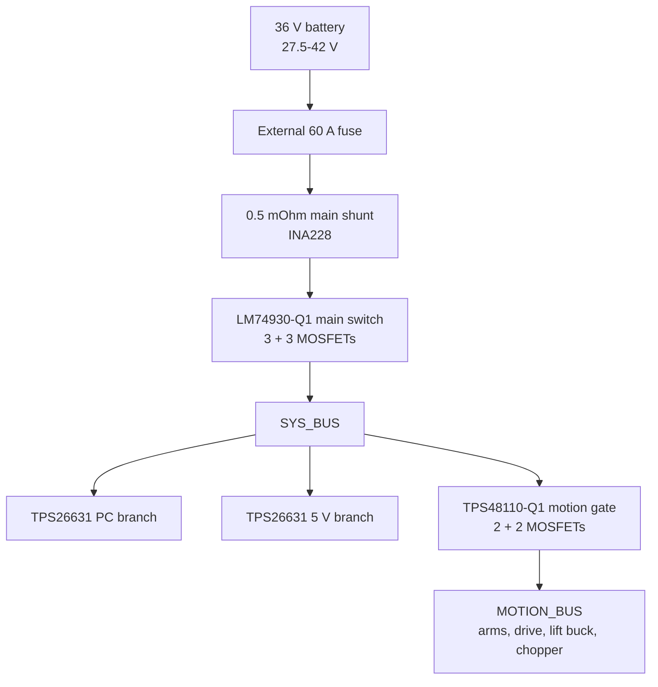

# HomeMy Power Management Unit (PMU): GPT Astra PCB Handoff

Status: ready for schematic capture and controlled pre-layout; **not released for fabrication**.  
Revision: 0.1  
Date: 2026-09-10  
Design authority: HomeMy project owner.

## 1. Purpose and design gate

This brief gives GPT Astra the accepted HomeMy Power Management Unit (PMU) behavior and current simplifications for a KiCad implementation.

Astra may create the hierarchical schematic, footprints, preliminary placement, net classes, and a routing strategy. Astra must not mark the design production-ready, generate fabrication files for ordering, or silently invent values for items marked `OPEN` or `BLOCKER`.

Status meanings: implement `LOCKED` requirements as written; make `PROVISIONAL` values configurable and testable; select or explicitly question `OPEN` items; never release fabrication while a `BLOCKER` remains.

If sources disagree, use this precedence:

1. `hardware/power-management-unit/requirements.yaml` for explicit value/status pairs;
2. this handoff for topology and implementation intent;
3. `hardware/power-management-unit/interfaces-and-layout.md` for physical interfaces and layout constraints;
4. the dated power-architecture decision;
5. lifecycle and customer-power contracts.

Stop and record a design question instead of resolving a safety-relevant conflict by assumption.

## 2. Scope

The board shall provide:

- fused-battery input connection and total high-side current measurement;
- electronic main ON/OFF, reverse-current blocking, over/undervoltage response, and hard-fault latch;
- one independently controlled and monitored motion-power gate;
- passive motion outputs for both arms, drive motors, and the external 24 V lift converter;
- resettable electronic protection for the external computer converter and external 5 V converter;
- a motor-bus brake chopper with an off-board resistor bank;
- ESP32-S3 power/lifecycle control, INA228 acquisition, CAN telemetry, power-button handling, faults, and LED-strip data;
- test points and hardware fault signals suitable for staged motorless commissioning.

Not on this PCB:

- the battery BMS, charger, or the battery's external 60 A main fuse;
- the 12 V, 24 V, or 5 V DC/DC power modules;
- RobStride, ESS23, or ESS17 motor electronics;
- the two existing isolated USB-RS485 adapters, USB-CAN adapter, powered USB hub, OAK USB 3 path, or Linux computer;
- a permanent customer display;
- branch melting fuses, a contactor, or a populated precharge circuit.

The final product has one customer-facing momentary Power button and no customer-facing mechanical master switch. An accessible service disconnect may exist elsewhere in the product, but it is outside this PCB brief.

## 3. Authoritative power tree

Use a star power topology from the relevant protected bus. Do not use a star CAN topology. High-current negative returns meet at the board's defined power-star region and must not flow through the ESP32/INA228 signal-ground region.

### Required positive-side net sequence

`BATT_FUSED_P` -> `RSH_MAIN` -> `BATT_SENSED_P` -> `MAIN_FET_BANK_A/B` -> `SYS_BUS_P`.

`SYS_BUS_P` -> `RSH_MOTION` -> `TPS48110 motion FETs` -> `MOTION_BUS_P`.

`BATT_N` is the high-current return reference. Define separate branch-return nets or zones until they meet at the intentional star point. Do not create accidental return sharing through small connectors, test headers, shields, or controller ground.

## 4. Source and load envelope

### Battery (`LOCKED`)

- LERIAN POWER 10S7P lithium-ion pack;
- 36 V nominal, 42 V full, 27.5 V BMS cut-off;
- 17.5 Ah, 630 Wh;
- 50 A maximum continuous discharge;
- advertised 150 A for 1-3 s is a survival/fault case, not an operating target;
- separate charge and discharge ports;
- the discharge lead includes a 60 A fuse;
- charging or regeneration through the discharge port is not permitted.

The external fuse must have a verified DC voltage rating of at least 42 V; 58/60 V DC or higher is preferred. This rating and its time-current curve are a `BLOCKER`.

### Loads

| Load | Quantity | Supply path | Working envelope |
| --- | ---: | --- | --- |
| RobStride02 joints | 8 | arm outputs / motion bus | 24-60 V; use 170 W per unit only as a conservative planning value. |
| RobStride00 joints | 4 | arm outputs / motion bus | 24-60 V; planning estimate 160-190 W per unit. |
| ESS23-RS20 drive | 2 | drive output / motion bus | 24-48 V, configured peak-current range up to 4 A each. |
| ESS17-RS07 lift | 2 | external 24 V buck / motion bus | 24 V, up to 2 A setting each; both may run together. |
| Computer and sensors | 1 branch | TPS26631 -> external 12 V buck | 65 W battery-side software budget; measured basic Ubuntu state was about 25 W before the converter, without ROS. |
| 5 V logic and LED | 1 branch | TPS26631 -> external 5 V buck | Buy at least 5 V/5 A continuous; no software current limit is relied upon for protection. |

At 27.5 V, 65 W is 2.36 A ideal. Allow approximately 3 A battery input for the PC branch before converter validation. The branch eFuse protects wiring and converter faults; it is not a precision 65 W limiter. The 65 W budget is enforced by Linux/BIOS CPU power configuration and verified during system commissioning. There is no dedicated PC-branch current sensor.

The theoretical simultaneous rated arm load can exceed the battery's 50 A limit. A global motion power/torque coordinator therefore keeps total battery current at or below 45 A in normal operation. This software policy does not replace connector, cable, BMS, eFuse, or fuse protection.

## 5. Protection coordination

Only the battery's external 60 A melting fuse is used. All other intended branch protection is resettable electronic protection or existing converter/motor protection.

| Layer | Device or mechanism | Initial action | Retry policy | Status |
| --- | --- | --- | --- | --- |
| Battery last resort | external 60 A fuse and BMS | fire/fault containment; BMS cut-off at 27.5 V | physical service / charger-defined | `LOCKED`, ratings to verify |
| Main path | LM74930-Q1 and 3+3 external 100 V NMOS | reverse-current block, UV/OV, overcurrent, short | latched; deliberate Power-button restart only | `PROVISIONAL` thresholds |
| Motion path | TPS48110-Q1, 0.5 mOhm shunt, 2+2 external 100 V NMOS | disconnect all actuator branches | latched; explicit ESP32 reset only | `PROVISIONAL` thresholds |
| Computer input | TPS26631 | current/short/thermal protection for converter harness | controlled retry/latch mode to be selected | `OPEN` settings |
| 5 V converter input | TPS26631 | current/short/thermal protection for converter harness | controlled retry/latch mode to be selected | `OPEN` settings |
| 24 V lift converter | converter internal OCP plus common motion gate | converter-specific | converter-specific | `BLOCKER` until tested |
| Individual actuators | internal motor-drive protection | actuator-specific | actuator-specific | external to PCB |

### Starting thresholds

All thresholds are `PROVISIONAL` except mandatory reverse-current blocking and the policy of no more than 45 A total battery current in normal operation. The voltage sequence is 33.0 V warning/10 s, 31.5 V task rejection/5 s, 30.5 V controlled shutdown/5 s, 29.0 V main hardware latch/about 0.5 s, and at least 32 V plus a deliberate press for restart. Initial input OVP is 44-45 V.

The current sequence is warning/derating above 45 A for 1 s, controlled motion stop above 50 A for 2 s, motion latch around 60 A, main latch around 65 A/0.5 s, and fast short response around 100 A motion or 120 A main. `requirements.yaml` is authoritative for the individual values.

Do not calculate a 0.5 s TPS48110 timing capacitor by linear scaling from a short datasheet example and then treat it as released. A long analogue timer may require an impractically large capacitor and can become leakage- and tolerance-sensitive. Astra shall calculate the valid timer range from the current TI datasheet, show worst-case tolerances, and propose either a shorter reliable hardware delay coordinated with software or a proven 0.5 s implementation. This is a `BLOCKER`.

Selectivity between the motion 60 A trip, main 65 A trip, 60 A external fuse, battery BMS, and motor transients must be plotted before fabrication release. The present numbers overlap once tolerances are included.

## 6. Main measurement and switching

### Main shunt and INA228

- `RSH_MAIN`: 0.5 mOhm, four-terminal, preferred rating at least 10 W;
- documented pulse capability target: at least approximately 34 J;
- high-side placement directly after the external 60 A fuse;
- INA228 powered from 3.3 V and routed with true Kelvin pairs;
- use the INA228 +/-163.84 mV range initially, giving about +/-327.7 A full scale;
- expose INA `ALERT`, I2C, and local filtered bus-voltage measurement to the ESP32;
- include zero-current calibration and temperature-drift provisions in firmware/test documentation.

At 45/50/60/120/150 A the shunt produces 22.5/25/30/60/75 mV and dissipates about 1.01/1.25/1.80/7.20/11.25 W respectively.

Sharing `RSH_MAIN` with the LM74930-Q1 sense path is allowed only after Astra demonstrates compatible polarity, common-mode range, input filtering, threshold programmability, Kelvin routing, and failure independence. Otherwise Astra must raise a design question; it may not insert a second high-current shunt silently.

### Main FET stage

- LM74930-Q1 design direction;
- two opposing back-to-back FET banks;
- three parallel 100 V N-channel MOSFETs per bank, six total;
- target individual RDS(on) no more than approximately 1.5 mOhm at 25 C and no more than approximately 2.5 mOhm at the validated hot condition;
- individual gate resistors, symmetrical source/drain copper, equal thermal environment, and Kelvin sense routing;
- verify maximum gate charge, controller drive capability, turn-off stress, linear-mode SOA, avalanche strategy, and 150 A/1-3 s transient thermal impedance;
- place temperature sensing at the thermally worst main-bank location.

With 2.5 mOhm hot per device, the two-bank path estimate is 1.67 mOhm and approximately 4.2 W at 50 A or 6.0 W at 60 A. These are estimates, not acceptance evidence.

No populated precharge circuit is required in revision 0.1. Provide access for inrush measurement and avoid a layout that makes a later revision impossible. If measured inrush, battery sag, connector arcing, or FET stress fails the verification plan, precharge returns as a design change.

## 7. Motion gate and passive outputs

- one common TPS48110-Q1-controlled motion gate;
- separate `RSH_MOTION`: 0.5 mOhm, four-terminal, at least 5 W, true Kelvin routing;
- two parallel 100 V N-channel MOSFETs per opposing bank, four total;
- target individual hot RDS(on) no more than 2.0-2.5 mOhm at the selected gate voltage;
- expose `MOTION_EN`, `MOTION_FLT`, `MOTION_IMON`, and MOSFET temperature to the ESP32;
- fail-safe default is motion off; controller reset, missing heartbeat, boot, fault, and shutdown must not turn motion on;
- use latch-off for hard faults; no autonomous repeated retry.

There are no per-arm eFuses, arm MOSFETs, arm shunts, or arm temperature sensors. `ARM_L` and `ARM_R` are passive protected outputs after the common motion gate. The exact arm connector remains a release blocker: a two-contact Mega-Fit candidate is acceptable only if its exact housing/contact/wire/temperature derating and an enforceable per-arm current envelope are proven. If one arm can exceed the derated connector limit, select a higher-current connector instead of relying on undocumented margin.

The two ESS23 motors share one isolated RS485 bus external to the PMU. The two ESS17 motors share the other external isolated RS485 bus. The PMU does not duplicate these transceivers.

## 8. Regeneration and brake chopper

The battery must not absorb regenerative current. Main reverse-current blocking is mandatory, and the main motion-bus chopper must operate without ESP32 firmware.

Current starting concept:

- resistor bank: two external 10 ohm/100 W aluminium-housed resistors in parallel, 5 ohm effective;
- resistor bank documented pulse-energy capability: at least 500 J for the verified duty cycle;
- one suitably rated 100 V low-side N-channel MOSFET with verified SOA and transient thermal path;
- independent analogue comparator/reference/hysteresis and gate drive powered from `MOTION_BUS`, so it continues to work while that isolated motor bus contains energy;
- resistor NTC and chopper status/fault signal to the ESP32;
- mount resistors to a metal chassis heat spreader, away from printed polymer;
- no melting branch fuse; a chopper short/stuck-on is detected by current/temperature protection and causes a latched shutdown.

At 43 V and 5 ohm, total current is 8.6 A and instantaneous dissipation is about 370 W, or about 185 W per resistor. The 100 W nameplate value is not a continuous rating for this operating point. Actual pulse curves, chassis thermal resistance, arm energy, drive energy, and repetition rate are `BLOCKER` items. Upgrade the resistor technology/power if the 500 J and thermal tests are not met.

| `MOTION_BUS` voltage | Initial action |
| ---: | --- |
| below 42.4 V | chopper off |
| 43.0 V | chopper on |
| 43.5 V | overvoltage warning/log |
| 45.0 V | reduce regenerative braking and command controlled stop |
| 46.0 V | hardware motion enable off |

TVS parts are for fast transients only and must never be sized as the normal braking-energy sink. Exact TVS, comparator, reference, driver, MOSFET, NTC, hysteresis, and threshold-tolerance chain remain open.

The external 24 V buck for the two vertical lifts may isolate its output from the main chopper. Provide a DNP connector/test point for an optional local 24 V clamp and capture the 24 V output during lowering/deceleration tests. Do not populate a second chopper until those measurements justify it.

## 9. Power controller, button, LED, and CAN

### ESP32-S3

Use an ESP32-S3 module approach for the prototype, not a bare RF design. The current candidate is the ESP32-S3-WROOM-1 class; exact flash/PSRAM and antenna variant is a `BLOCKER` because it controls footprint and keep-out. Retain accessible programming/recovery pads. A service USB connector is optional and must not be confused with the Linux USB-CAN or USB-RS485 adapters.

The ESP32 shall monitor/control at least:

- INA228 I2C and alert;
- main and motion fault/latch state;
- motion enable and explicit latch reset;
- main/motion/chopper temperature inputs;
- chopper active/fault state and bus overvoltage divider;
- Power-button state and self-hold;
- Linux heartbeat/shutdown acknowledgement through the selected communication contract;
- addressable LED data;
- CAN power telemetry.

### Always-on wake and self-hold (`BLOCKER`)

When the robot is off, the ESP32, LED strip, Linux PC, and normal 5 V converter are unpowered. Only the battery/BMS, LM74930 shutdown domain, and a low-quiescent-current hardwired Power-button/wake latch remain connected.

The circuit must:

1. accept a deliberate momentary press while off;
2. assert the main enable long enough for 5 V and ESP32 startup;
3. transfer hold authority to `ESP_MAIN_HOLD`;
4. deliver short presses while on as shutdown requests;
5. allow a hardware long-press fallback even if Linux and ESP32 software are stuck;
6. prevent automatic restart after brownout, fault recovery, or battery reconnection;
7. avoid an unsafe motion enable during every transition.

Exact debounce, long-press duration, hold-transfer timeout, shutdown grace time, high-voltage always-on supply, latch/supervisor, and FET/interface parts are open. Astra shall implement this as a separate hierarchical sheet and provide a timing/state note. Do not power the wake latch from the switched 5 V rail only; that creates a start-up deadlock.

### Status LED

- WS2812B- or SK6812-class external 5 V strip;
- 74AHCT125-class 3.3-to-5 V data buffer;
- 220-330 ohm source-series data resistor;
- about 1000 uF, at least 10 V, near the strip connector;
- external 5 V converter sized for at least 5 A continuous;
- no software current limit is credited as electrical protection; animation brightness remains an aesthetic/thermal setting.

Required states are OFF/dark, BOOTING/blue pulse, SELF_TEST/yellow movement, READY/green, READY_LIMITED/amber, OPERATING/cyan, FAULT/red flash, and SHUTTING_DOWN/violet pulse.

### CAN

- classical CAN at 1 Mbit/s;
- twelve RobStride joints plus ESP32 power telemetry;
- expected 100 Hz joint command/feedback, target measured bus load below 50 percent;
- physical linear backbone with exactly two 120 ohm end terminations;
- no star wiring; PCB stub from connector to transceiver must be short;
- provide selectable local 120 ohm termination, normally DNP unless this board is a physical end;
- CAN transceiver, ESD network, common-mode/chassis strategy, and connector shield treatment remain `OPEN`;
- the isolated USB-CAN adapter is external and connects to Linux through SocketCAN.

## 10. Layout, interfaces, and Astra output

Connector choices, wiring, PCB partitioning, layout constraints, component classes, required Astra deliverables, and the fabrication-blocker checklist are maintained in `hardware/power-management-unit/interfaces-and-layout.md`.

Astra must read that file before assigning footprints or creating the board outline. Until every blocker named there and in `requirements.yaml` is closed, the output is an engineering prototype design for review and motorless testing only.
